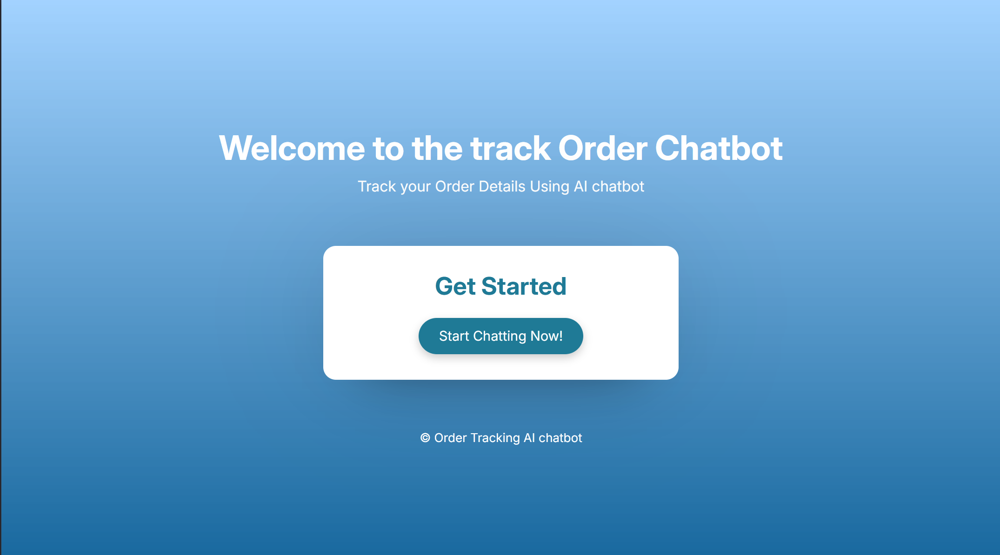
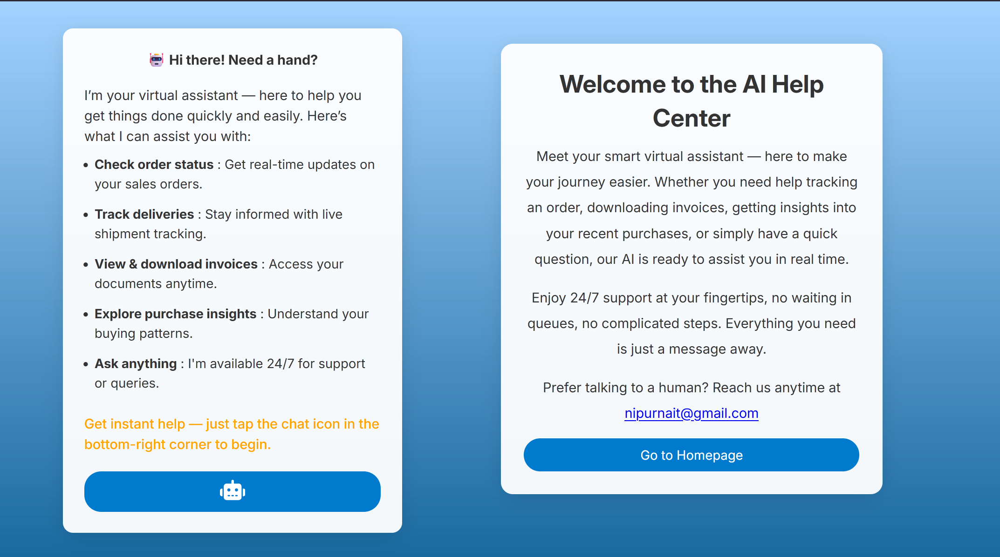
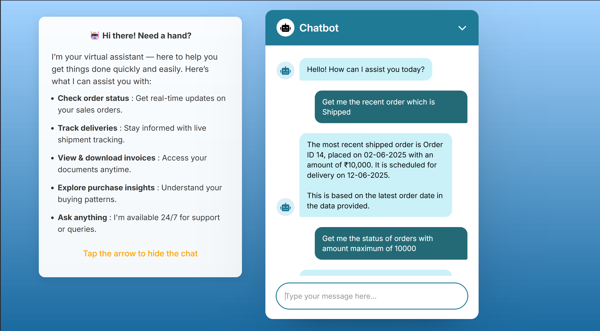
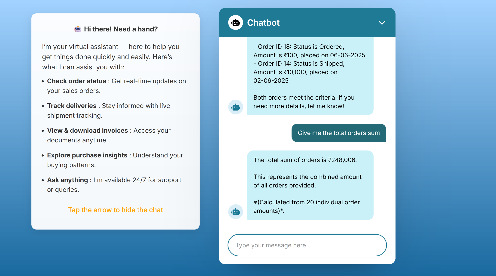
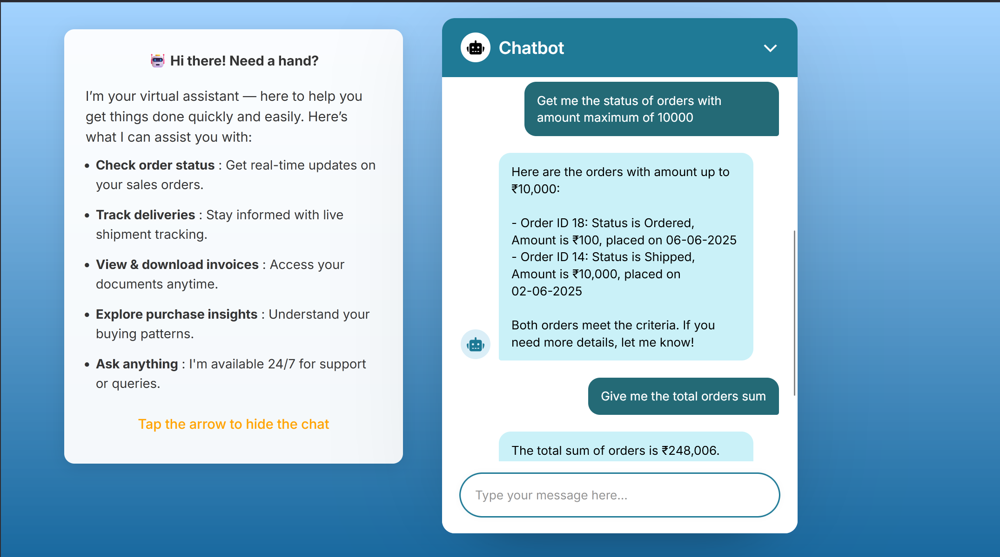

# 🧠 AI-Powered Order Tracking Chatbot using AWS + React

This project was developed during my internship at **Nipurna IT Solutions Pvt. Ltd.**, where I built a **smart AI-powered chatbot** that responds to natural language queries about order data in real-time.

The system integrates:
- **React.js** for an interactive front-end UI
- **AWS Lambda** + **API Gateway** for serverless backend logic
- **DynamoDB** for real-time order data storage
- **OpenRouter’s DeepSeek LLM** to convert natural language into executable DynamoDB queries

Users can ask the chatbot things like:
- “What’s the status of order 11?”
- “Get me the recent shipped order.”
- “Show orders with amount over 10,000.”
- “Total of all orders placed this month.”

🛠️ This chatbot automatically parses intent, generates a valid query (`QueryCommand` or `ScanCommand`), fetches the data from DynamoDB, and returns a human-like response — all in real time.

---

## 💡 Why This Project Matters

This project combines **AI**, **cloud computing**, and **frontend development** into one seamless workflow:
- Automates customer support  
- Demonstrates practical LLM usage for query generation  
- Uses real AWS infrastructure (Lambda, DynamoDB, API Gateway)  
- Hosted with **AWS Amplify**

It represents a real-world application of **AI+Cloud** for intelligent automation.

---                                                                     ---

## 📸 Screenshots

### 1. Welcome Screen: 
Clean responsive UI react page.

### 2. Chatbot Home Screen: 
Clean responsive UI react page with navigation button too.

### 3. Real-Time Order Status Query example
User asks: `"Get me the recent orders which is shipped"`  
The chatbot responds with accurate, AI-generated details from DynamoDB.

---

###  4. Total Amount of Orders
Query: `"Get me the total orders sum?"`  
Chatbot returns a calculated sum using a ScanCommand and AWS Lambda.

---

### 5. Orders with specific amount
Query: `"Get me the status of orders with maximum amount of 10000"`  
Chatbot returns a list of orders using a QueryCommand and AWS Lambda.

---

Here is the hosted amplify link which is live website : https://main.d2loafmlz5ijdm.amplifyapp.com/